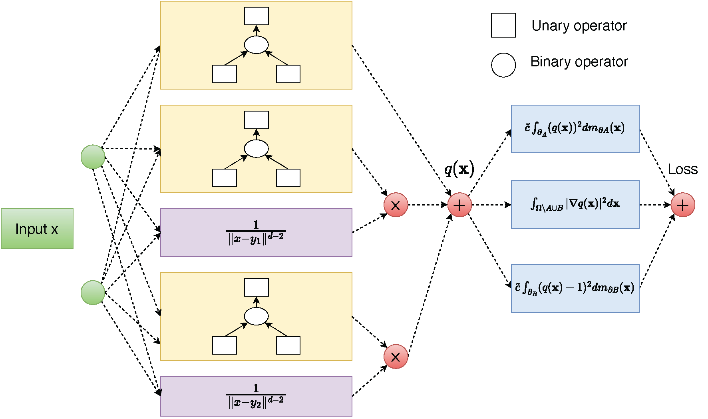

# Finite-expression-method for solving committor problems


By [Zezheng Song](https://zzsong1023.github.io/)

This repo is the official implementation of "A Finite Expression Method for Solving High-Dimensional Committor Problems" (SIAM Journal on Scientific Computing)[[paper]](https://arxiv.org/abs/2306.12268).

## Introduction

Finite EXpression Method (FEX) approximates the committor by an algebraic expression involving a fixed finite number of nonlinear functions and binary arithmetic operations. The optimal nonlinear functions, the binary operations, and the numerical coefficients in the expression template are found via reinforcement learning. The FEX-based committor solver is
tested on several high-dimensional benchmark problems. It gives comparable or better results
than neural network-based solvers. Most importantly, FEX is capable of correctly identifying
the algebraic structure of the solution which allows one to reduce the committor problem to a
low-dimensional one and find the committor with any desired accuracy.



## Environment
* [PyTorch 1.0](http://pytorch.org/)

## Code structure

```
FEX_committor
├── Butane
│   ├── butane.py
│   ├── computational_tree.py
│   ├── controller_butane.py
│   ├── function.py
│   ├── function_committor.py
│   ├── scripts_butane.py
│   ├── tools.py
│   └── utils
│       ├── __init__.py
│       ├── eval.py
│       ├── logger.py
│       ├── misc.py
│       └── visualize.py
├── ConcentricSphere
│   ├── computational_tree.py
│   ├── controller_coecentric.py
│   ├── figures
│   │   ├── FEX_2sphere.png
│   │   └── FEX_2sphere_depth3.png
│   ├── function.py
│   ├── function_committor.py
│   ├── scripts_cs.py
│   ├── tools.py
│   └── utils
│       ├── __init__.py
│       ├── eval.py
│       ├── logger.py
│       ├── misc.py
│       └── visualize.py
├── DoubleWell
│   ├── computational_tree.py
│   ├── controller_pwell.py
│   ├── function.py
│   ├── function_committor.py
│   ├── scripts_pwell.py
│   ├── tools.py
│   └── utils
│       ├── __init__.py
│       ├── eval.py
│       ├── logger.py
│       ├── misc.py
│       └── visualize.py
├── README.md
└── fex_committor_tree.png

```
## Citing FEX
If you find this code repository helpful, please consider citing our paper:
```
@article{song2023finite,
  title={A finite expression method for solving high-dimensional committor problems},
  author={Song, Zezheng and Cameron, Maria K and Yang, Haizhao},
  journal={arXiv preprint arXiv:2306.12268},
  year={2023}
}
```
## Acknowledgments

We appreciate [Luke Evans](https://github.com/aevans1) for providing the molecular simulation data of butane.
